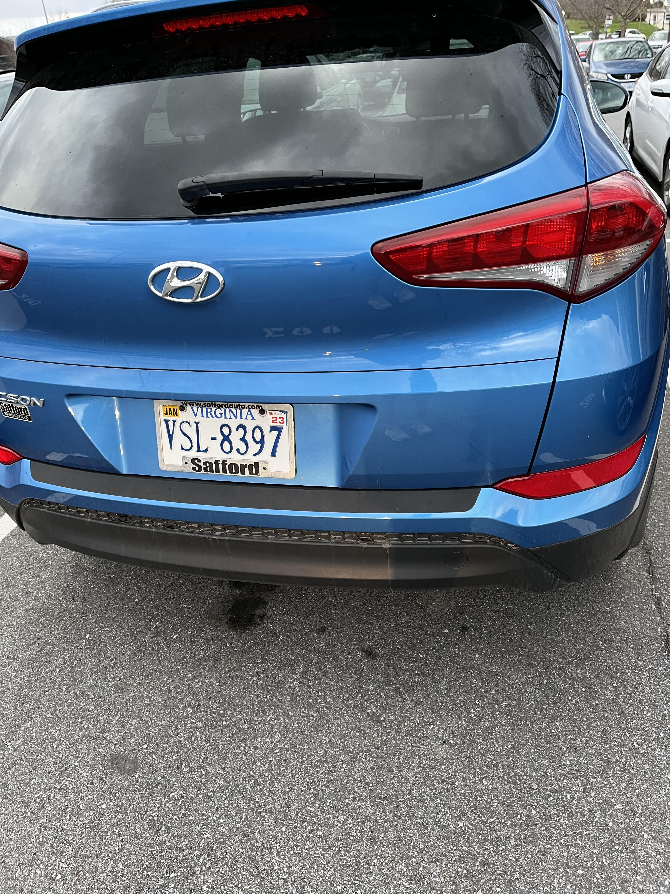
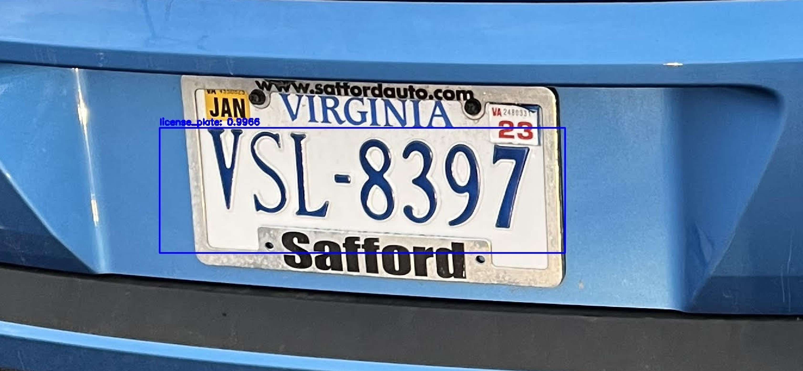
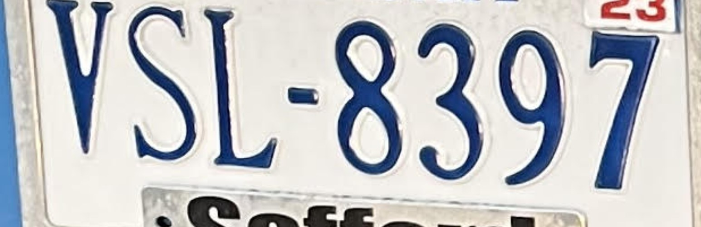
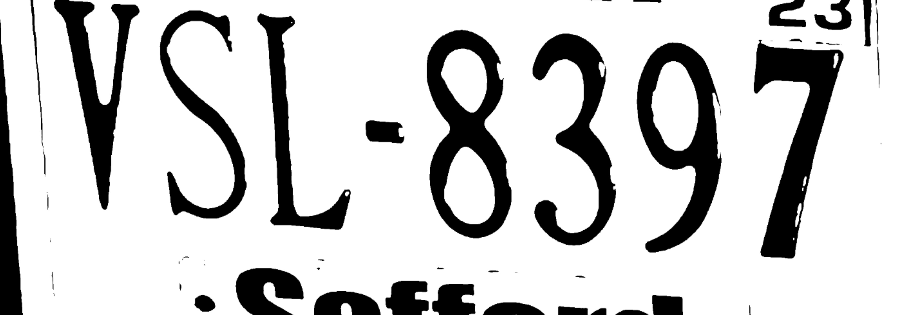

# ECE 4424 - Spring 2022 Project
Automated Multiple License Plate Recognition (AMLPR) Software Project   
Spring 2022 Semester in ECE 4424 at Virginia Tech  
Dr. Bhattacharya  

This repository is released under the MIT license, please see the LICENSE file for details.

## Dependencies
### Datasets
lp_loc_img_data - UCSD California license plate image dataset with license plate location labels (80:20 train:test split).1  
lp_num_img_data - UCSD California license plate image dataset with license plate number labels (80:20 train:test split).1   
custom - Virginia license plate images and video dataset with no labels (contains various distances from license plate and various numbers of license plates in a given frame)

### Packages
See requirements.txt

### Weights
Zenodo Link: https://doi.org/10.5281/zenodo.6459145  
Trained YOLO model weights stored on Zenodo in a zip file due to the weight file sizes being too large for GitHub.

## How to Run
See README in yolo directory for file addition requirements from Zenodo.  

Commandline Usage:  
For a custom image/video:  
> licenseplate.py [-h] [--video VIDEO_FILENAME] [--image IMAGE_FILENAME]  

To evaluate the current software's detection accuracy, recognition accuracy, and efficiency on UCSD license plate dataset:  
> evaluate.py

### Directory Descriptions
datasets - contains UCSD and custom license plate dataset as described in Dependencies section  
detection - contains all supporting files and directories required to run the detection notebook to perform data processing and train/tune the YOLO model  
examples - source images used in GitHub README below  
literature - contains original project proposal, project midway progress report, and project final report  
notebooks - contains two notebooks used for primary development of the detection and recognition modules for the AMLPR software  
recognition - contains all supporting files and directories required to run the recognition notebook to perform data processing and tune the OCR algorithm  
yolo - contains all supporting files required to load the trained YOLO model in the licenseplate.py program  

## Incremental Image Input to Output Examples
### Original Input Image

### Detection Image

### Cropped Image

### Processed Image

## Citations  
[1] L. Dlagnekov and S. Belongie, "UCSD/Calit2 Car License Plate, Make and Model Database"  
    http://vision.ucsd.edu/belongie-grp/research/carRec/car_data.html  
    
[2] J. Redmon and A. Farhadi, "YOLOv3: An Incremental Improvement"  
    https://doi.org/10.48550/arXiv.1804.02767  
    
[3] S. Nayak, "Training YOLOv3 : Deep Learning based Custom Object Detector"  
    https://learnopencv.com/training-yolov3-deep-learning-based-custom-object-detector/  
    
[4] A. Rosebrock, "Detecting and OCR’ing Digits with Tesseract and Python"  
    https://pyimagesearch.com/2021/08/30/detecting-and-ocring-digits-with-tesseract-and-python/  
